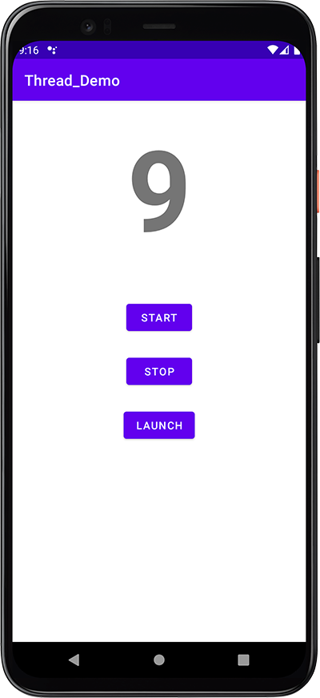

# Thread_Demo
How to implement multi thread runnable in Android Studio with Java

## YouTube Tutorial
I haven't made a video tutorial for this project yet. Subscribe to my channel to get updated if I do. https://bit.ly/3MBVF1E

## Project Info
Basic example of how to implement a multi-threaded app in Android Studio with Java. Concept is to start a countdown that runs in its own thread and updates a TextView with the current count.
The countdown can be cancelled at any time by clicking the stop button. Clicking the launch button will launch our rocket but only if the countdown has been completed.

## Screenshot
